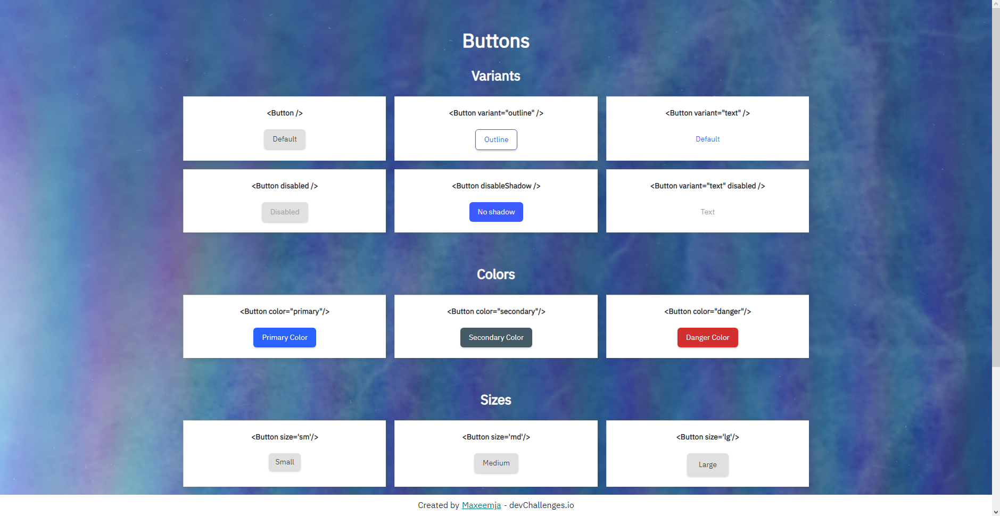

<h1 align="center">ReUsable Button component</h1>

   Solution for a challenge from <a href="http://devchallenges.io" target="_blank">Devchallenges.io</a>.

  <h3>
    <a href="https://maxeemja.github.io/Button-Component/">
      Demo
    </a>
     | 
    <a href="https://devchallenges.io/solutions/9m4KeXVpPqiBvWKp7qsG">
      Solution
    </a>
     | 
    <a href="https://devchallenges.io/challenges/ohgVTyJCbm5OZyTB2gNY">
      Challenge
    </a>
  </h3>

<!-- TABLE OF CONTENTS -->
- [Overview](#overview)
    - [Built With](#built-with)
- [Features](#features)
- [Inspiration](#inspiration)

## Overview
This is a button component which you can test with a demo.

- 1st Dev Challenges project
### Built With

- HTML
- CSS
- JS/React

## Features
- Reusable button component, change color, icon or/and variant.

## Inspiration
This my first tiny project from front-end category. It helped me better understood how to work with props and dynamic styles in React framework.

